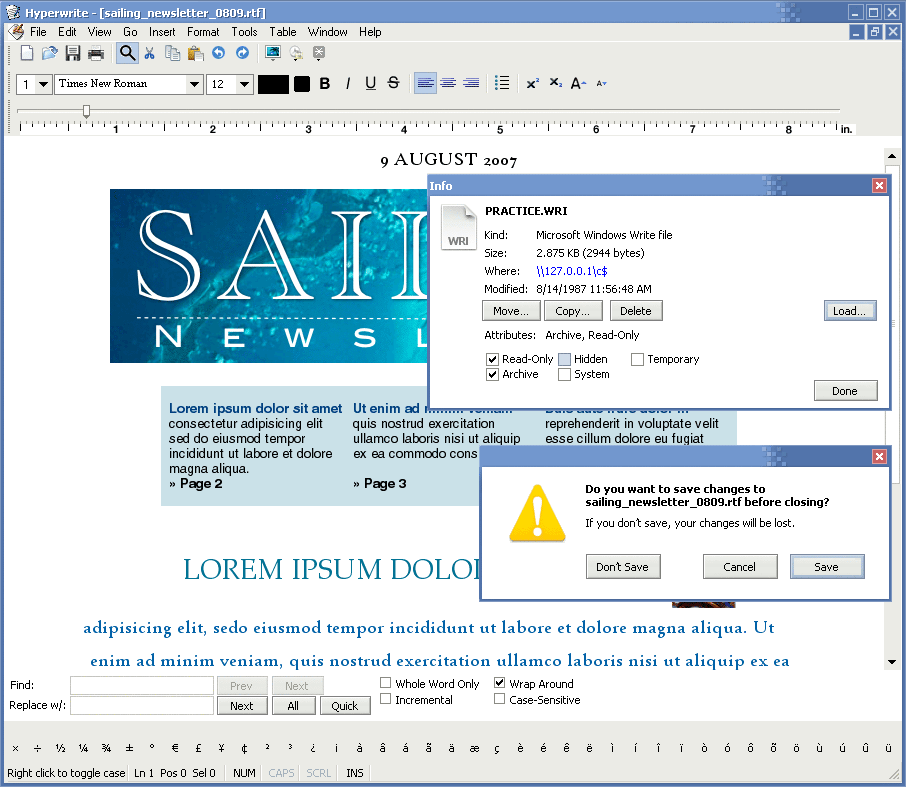



## Hyperwrite 2\.0

### Description

A word processor with lots of features. Improvements/new features over version 1.0:

- Enhanced word count (simpler code, faster, more accurate); new live word count

- SymbolMatic improvement (pressing backspace after a correction undos it)

- List of fonts used in document generated by parsing the RTF font table

- Multiple underline styles

- Ability to replace all instances of a font in a document

- Improved Find/Replace (incremental find, replace all bugfix, Wrap Around option)

- Preferences with a text file instead of registry

- Common Dialog with API, not OCX

- Toolbar icons stored in a directory to allow customization

- Semi-preview font selector combo box

- Improved Get Info dialog and contextual image/text info in document

- New table features (Add/Remove column), improved Elastic Table

- Theme-aware controls (thanks to GlyphLab)

- and more.

NOTE: Because Hyperwrite 2.0 does not use the Common Dialog OCX, for printing it needs the VB Print Dialog library available at:

http://download.microsoft.com/download//vb60pro/utility/1.0/win98mexp/en-us/vbprndlg.exe
 
### More Info
 

             |
---                |---
**Submitted On**   |2007-08-26 11:06:42
**By**             |[NIXON Software](https://github.com/Planet-Source-Code/PSCIndex/blob/master/ByAuthor/nixon-software.md)
**Level**          |Intermediate
**User Rating**    |4.2 (21 globes from 5 users)
**Compatibility**  |VB 5\.0, VB 6\.0
**Category**       |[Complete Applications](https://github.com/Planet-Source-Code/PSCIndex/blob/master/ByCategory/complete-applications__1-27.md)
**World**          |[Visual Basic](https://github.com/Planet-Source-Code/PSCIndex/blob/master/ByWorld/visual-basic.md)
**Archive File**   |[Hyperwrite2080808262007\.zip](https://github.com/Planet-Source-Code/nixon-software-hyperwrite-2-0__1-69211/archive/master.zip)

